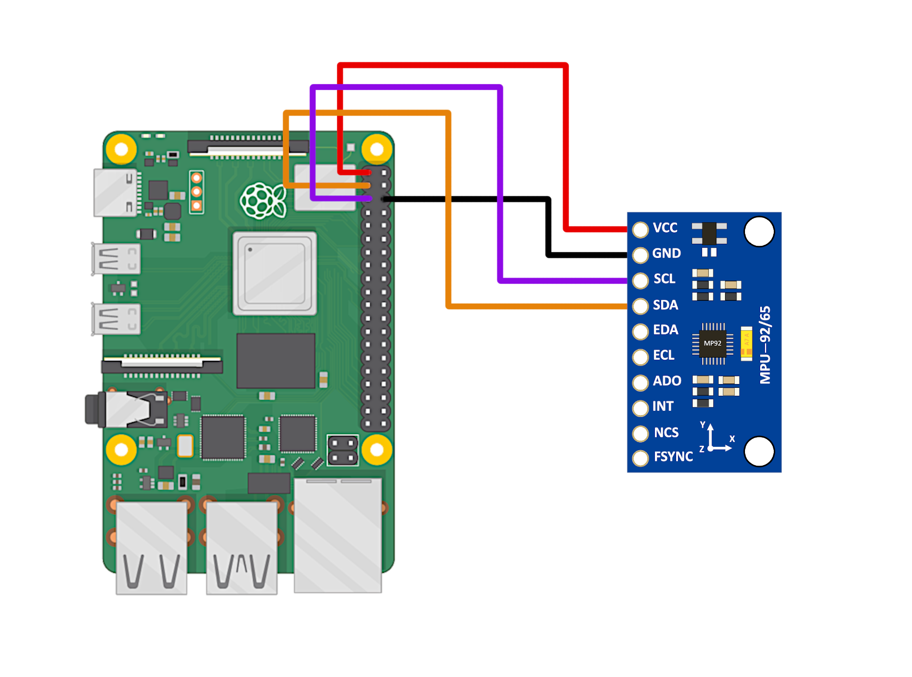
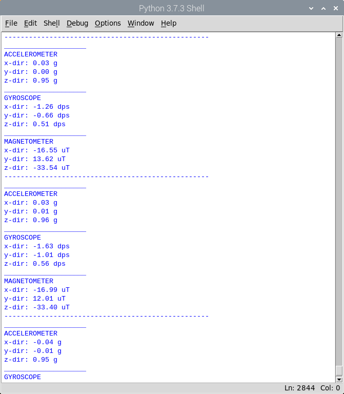
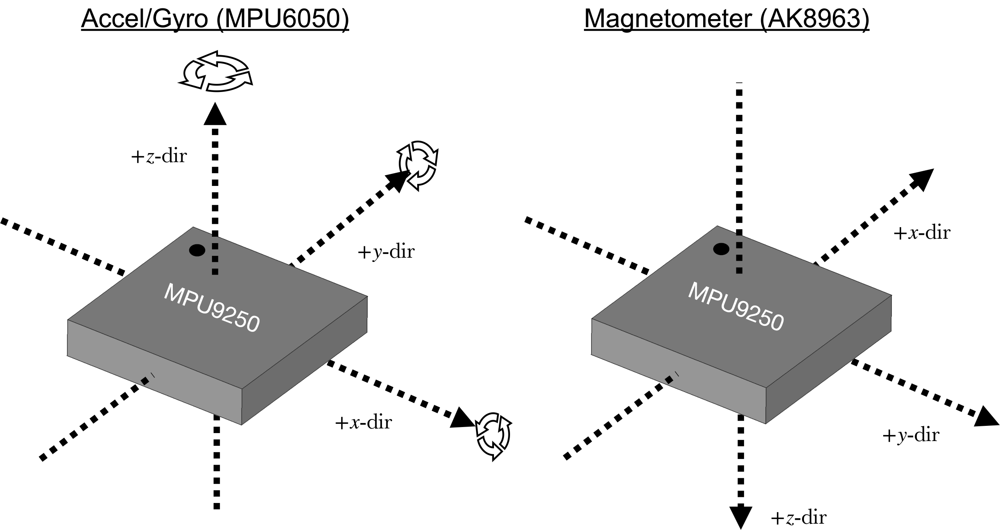
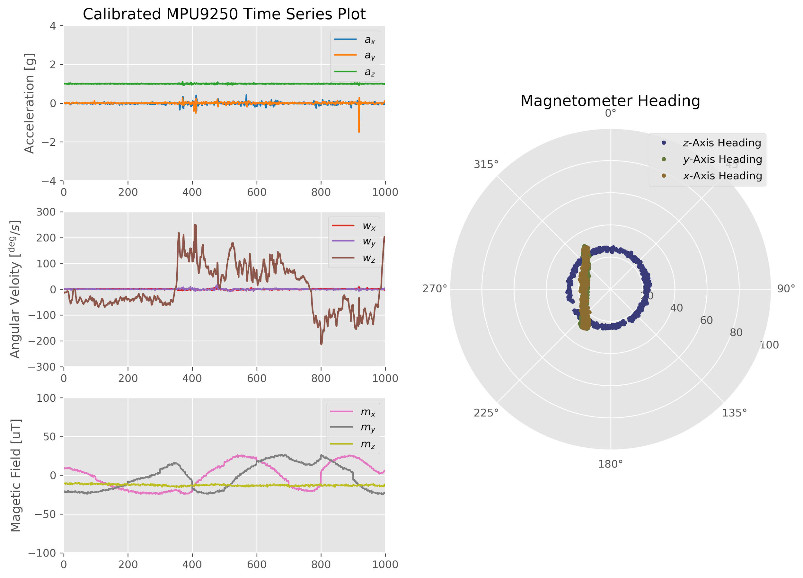
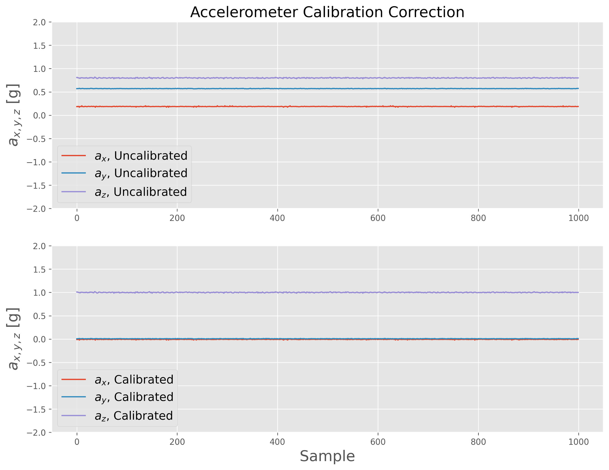
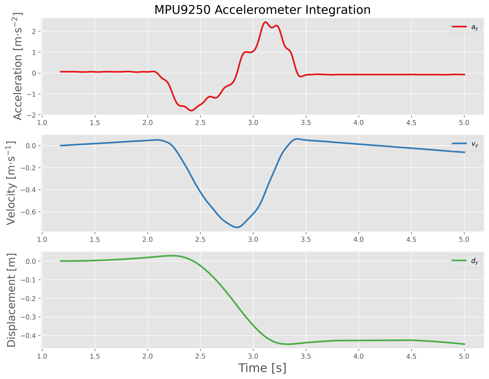
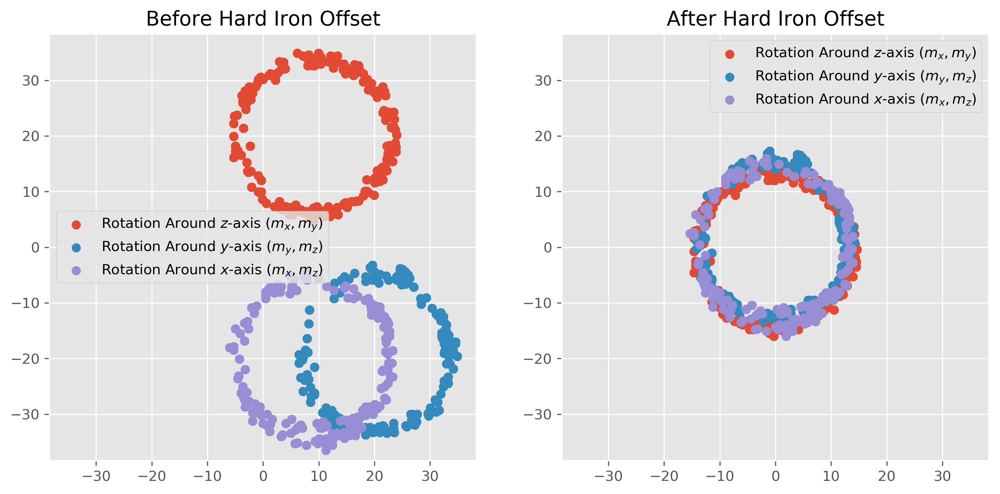

# MPU9250 Calibration using Python and a Raspberry Pi Computer
Calibration procedure for the MPU9250's accelerometer, gyroscope, and magnetometer using Python and a Raspberry Pi Computer.

Full tutorials at the following links:
- [Calibration of an Inertial Measurement Unit (IMU) with Raspberry Pi - Part I](https://makersportal.com/blog/calibration-of-an-inertial-measurement-unit-with-raspberry-pi)
- [Gyroscope and Accelerometer Calibration with Raspberry Pi](https://makersportal.com/blog/calibration-of-an-inertial-measurement-unit-imu-with-raspberry-pi-part-ii)
- [Calibration of a Magnetometer with Raspberry Pi](https://makersportal.com/blog/calibration-of-a-magnetometer-with-raspberry-pi)


### - Wiring Diagram - 

Power is supplied to the MPU9250 via the 3.3V/GND pins on the Raspberry Pi computer. The MPU9250 board communicates with the RPi over its Inter-Integrated Circuit (I<sup>2</sup>C) pins, labeled SDA/SCL on both the RPi and MPU9265 boards. On the RPi, SDA is located on hardware pin 3, and SCL is located on hardware pin 5. 

___
### - Python Library Installs and IMU Tests - 
Install the following Python packages onto the Raspberry Pi:
```bash
pi@raspberrypi~ $ sudo pip3 install scipy matplotlib numpy
pi@raspberrypi~ $ sudo apt-get install libatlas-base-dev
```
Upon successful of the library installs above, download the mpu9250_i2c.py (the main backend for reading the MPU9250) from the repository along with the imu_test.py code. 

- Run the imu_test.py 

Verify that the 9 variables are being outputted similar to the screenshot below:


___
### - Calibration Outline - 

The calibration procedure uses a uniform cube to calibrate each sensor on the IMU (accel, gyro, mag). There are different procedures involved in calibrating each sensor, which can be broken down as follows:

- Gyroscope: calibrate under steady conditions
- Accelerometer: calibrate under graviation for each axis
- Magnetometer: calibrate under 360 degree rotation for each axis

Keeping in mind the coordinate reference for the MPU9250:



___
### - Full Calibration and Real-Time Output -

The plot below is an example output of the following script:
- mpu9250_full_calibration.py



___
### - Gyroscope Calibration Output - 

The plot below is an example output of the following script:
- gyroscope_calibration.py


___
### - Accelerometer Calibration Output - 

The plot below is an example output of the following script:
- accel_calibration.py



___
### - Displacement Approximated from Accelerometer Double Integration - 

The plot below is an example output of the following script:
- accel_integration.py



___
### - Magnetometer Hard Iron Offset - 

The plot below is an example output of the following script:
- mag_hard_calibration.py



